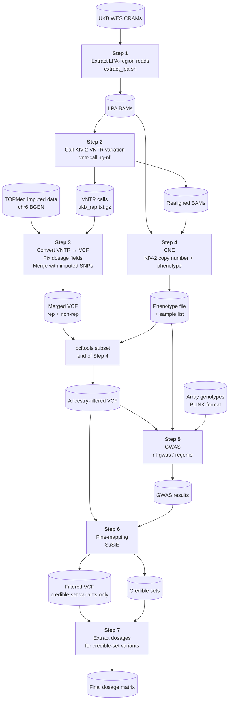

# Ancestry-Specific Genetic Architecture of *LPA*: Pipeline, Results, and Interactive Explorer

[](https://nextflow.io/)
[](LICENSE)
[](https://ukbiobank.dnanexus.com/)
[](https://doi.org/10.5281/zenodo.XXXXXXX)

---
## What's in this repository

This repository contains three components:

| Component | Location | Description |
|---|---|---|
| **Pipeline scripts** | [`scripts/`](scripts/) | Nextflow/shell scripts to run the full analysis on UKB RAP |
| **Summary results** | [`results/`](results/) | GWAS summary statistics and LD-residual files for European, African, and Asian ancestries |
| **Shiny app** | [`shiny_app/`](shiny_app/) | Interactive Manhattan/LD-residual explorer across ancestries |

To launch the Shiny app locally, open `shiny_app/app.R` in RStudio and click *Run App*, or run `shiny::runApp("shiny_app")` from the repository root.

---
## Funding

This work is supported by the Austrian Science Fund (FWF) under grant [PAT3357425 — Intra-Repeat VNTR Analysis and Risk Prediction](https://www.fwf.ac.at/forschungsradar/10.55776/PAT3357425) (PI: Sebastian Schönherr, Medical University Innsbruck).

---
## Contributors

[Institute of Genetic Epidemiology](https://genepi.i-med.ac.at/), Innsbruck

- **[Silvia Di Maio](https://genepi.i-med.ac.at/team/di-maio-silvia/)** — pipeline development, fine-mapping (SuSiE), variance explained, CVD analysis
- **[Johanna F. Schachtl-Rieß](https://genepi.i-med.ac.at/team/schachtl-riess-johanna/)** — fine-mapping methodology
- **[Sebastian Schönherr](https://genepi.i-med.ac.at/team/schoenherr-sebastian/)** — pipeline development, RAP infrastructure, GWAS

---
## Overview

Lipoprotein(a) [Lp(a)] is a major heritable cardiovascular risk factor whose plasma levels are largely determined by variation at the *LPA* locus. A key source of this variation is the kringle IV type 2 (KIV-2) variable number tandem repeat (VNTR), a highly repetitive region that is refractory to standard short-read alignment and therefore routinely excluded from GWAS. Accurately resolving KIV-2 copy number and intra-repeat sequence variation is essential for capturing the full genetic architecture of Lp(a) and for identifying causal variants through fine-mapping.

This repository documents the complete computational pipeline to integrate VNTR variation into GWAS analysis. All analyses have been run on UKB RAP. If you are new to RAP, have a look at the [Getting started with RAP](#getting-started-with-rap) section below.

> **Data availability:** Due to UK Biobank data access restrictions, we are unable to share non-aggregated data or sample IDs. Analyses were conducted under UKB application number **62905**. Please apply for data access directly through the [UK Biobank](https://www.ukbiobank.ac.uk/).

If you encounter any issues running the pipeline, please [open a GitHub issue](../../issues). For other enquiries, contact [Sebastian Schönherr](https://genepi.i-med.ac.at/team/schoenherr-sebastian/).

The pipeline consists of the following steps:

1. Extract *LPA*-region reads from UK Biobank whole-exome sequencing (WES) CRAM files
2. Call KIV-2 VNTR variation from BAM/CRAM files
3. Combine non-repetitive with repetitive region
4. Estimate per-sample KIV-2 copy number
5. Run combined GWAS for Lp(a) trait
6. Fine-map association signals using SuSiE
7. Extract dosages for credible-set variants


## Step 1 - Extract *LPA*-region reads from UK Biobank whole-exome sequencing (WES) CRAM files

The CRAMs are stored in a bucket that cannot be accessed directly. We therefore download the *LPA* CRAM files and extract the region.

### Input/Output
| | Files |
|---|---|
| **Input** | `ids_by_ancestry.txt` (e.g. full paths for a specific ancestry) |
| **Output** | Per-sample *LPA* BAMs (region chr6:160530483–160665260) |
| **Script** | `scripts/step1/extract_lpa.sh` |

### Workflow
* Execute `dx find data --path "Bulk/Exome sequences/Exome OQFE CRAM files" --name "*.cram" > ids.txt`
* Filter ids.txt by ancestry and save as `ids_by_ancestry.txt`
* Execute `scripts/step1/extract_lpa.sh`.

## Step 2 - Call KIV-2 VNTR variation from BAM/CRAM files

VNTR variation is resolved using a previously [published Nextflow pipeline](https://github.com/genepi/vntr-calling-nf).

### Input/Output
| | Files |
|---|---|
| **Input** | *LPA* BAMs from Step 1 |
| **Output** | VNTR calls (`ukb_rap.txt.gz`); realigned BAMs (`realigned/`) needed for Step 4 |
| **Script** | `nextflow run genepi/vntr-calling-nf -c ukb.config` ([vntr-calling-nf](https://github.com/genepi/vntr-calling-nf)) |

### 2.1 Set up the pipeline
Download the ROI-8 BED file (do not use the signature approach; only validated in EUR). For EUR, set `params.build="hg38"` and remove `params.region`.
```
wget https://raw.githubusercontent.com/genepi/vntr-calling-nf/refs/heads/main/paper_analysis/lpa/bed/hg38/ROI-8.bed
```

### 2.2 Create a config file
Create `ukb.config`:
```
params.project="ukb_rap_ancestry"
params.input="lpa_bams/*bam"
params.reference="reference-data/kiv2.fasta"
params.contig="KIV2_6"
params.region="ROI-8.bed"
```

### 2.3 Enable realigned BAM output
Required for Step 4. Enable output of realigned BAM data by adding the following to `local/realign_fastq.nf`:

```
publishDir "${params.outdir}/realigned", mode: "copy"
```

### 2.4 Run the pipeline
```
nextflow run genepi/vntr-calling-nf -r <version> -c ukb.config --profile docker
```

> **Note:** Pin `-r` to a specific release tag (current: `-r v0.4.9`) to ensure reproducibility. Check available releases at [github.com/genepi/vntr-calling-nf](https://github.com/genepi/vntr-calling-nf/releases).

## Step 3 - Combine non-repetitive with repetitive region
The VNTR calls from Step 2 are converted to VCF format and merged with TOPMed imputed SNPs covering the non-repetitive *LPA* locus. Dosage (DS) fields are harmonised across both sources to produce a single analysis-ready VCF.

### Input/Output
| | Files |
|---|---|
| **Input** | `ukb_rap.txt.gz` (VNTR calls from Step 2), `ukb21007_c6_b0_v1.bgen/.sample` (TOPMed imputed data, chr6 *LPA* locus) |
| **Output** | `ukb_combined_final_sorted_with_DS_noGT.vcf.gz` — merged VCF of VNTR repetitive region + imputed non-repetitive region, with DS dosage field |
| **Script** | `scripts/step3/fix_dosage.sh`, `scripts/step3/merge.sh`, `scripts/step3/dosage.sh` |

### 3.1 Convert VNTR results to a VCF file

```
wget https://github.com/seppinho/mutserve/releases/download/v2.0.3/mutserve.zip
unzip mutserve.zip

# Fix IDs to allow merging with imputed data
zcat ukb_rap.txt.gz | sed -e 's/_23143_0_0_lpa.extracted.kiv2.realigned.bam//g' > ukb_rap_renamed.txt

# Filter by PASS
awk -F'\t' 'NR==1 || $2=="PASS"' ukb_rap_renamed.txt > ukb_rap_renamed_filtered.txt

# Prepare reference (rename KIV2_6 to 6 to avoid merging issues)
wget https://raw.githubusercontent.com/genepi/vntr-calling-nf/refs/heads/main/reference-data/kiv2.fasta
# Edit kiv2.fasta: change "KIV2_6" to "6"

java -jar mutserve.jar create-vcf \
    --input ukb_rap_renamed_filtered.txt \
    --output ukb_rap_renamed_filtered.vcf.gz \
    --reference kiv2.fasta
```

### 3.2 Download the *LPA* non-repetitive region from TOPMed
```
qctool \
-g "ukb21007_c6_b0_v1.bgen" \
-s "ukb21007_c6_b0_v1.sample" \
-incl-range 6:160530484-160665259 \
-og "region_chr6.bgen"
```

### 3.3 Fix dosage fields in the non-repetitive region
The non-repetitive region may lack DS for 0/0 genotypes and sometimes contains only GT. We fix this by replacing GT-only entries with 0, 1, or 2 and by adding DS where DS is ".". The script is available in `scripts/step3`.

```
sh fix_dosage.sh
```

### 3.4 Merge non-repetitive and repetitive regions
```
sh merge.sh
sh dosage.sh
```

## Step 4 - Estimate per-sample KIV-2 copy number

Coverage-based copy number estimation (CNE) is performed using the original *LPA* BAMs and the realigned BAMs from Step 2. The resulting per-sample KIV-2 copy numbers are combined with Lp(a) phenotype data and covariates into a single phenotype file used for GWAS.

### Input/Output
| | Files |
|---|---|
| **Input** | *LPA* BAMs from Step 1 (`CRAMS/`), realigned BAMs from Step 2 (`realigned/`), BED files in `scripts/step4/input/` |
| **Output** | `coverage_summary_ukb.txt`; `phenotype_ukb_estimates_ancestry.txt` (per-sample KIV-2 copy number + Lp(a) phenotype + covariates) |
| **Script** | `scripts/step4/calc_estimates.sh`, `scripts/step4/phenotype.Rmd` |

### 4.1 Compute coverage estimates

```
sh calc_estimates.sh
```

### 4.2 Estimate copy number and prepare phenotype file

The Rmd script requires a tab-separated phenotype file (`ukb_allancestries.txt`) containing the following UK Biobank fields:

| Column | UKB Field | Description |
|---|---|---|
| `f.eid` | — | Sample identifier |
| `f.30790.0.0` | [30790](https://biobank.ndph.ox.ac.uk/showcase/field.cgi?id=30790) | Lp(a) plasma level (nmol/L), including out-of-range values (requires separate UKB data request) |
| `f.21000.0.0` | [21000](https://biobank.ndph.ox.ac.uk/showcase/field.cgi?id=21000) | Ethnic background (used for ancestry stratification) |
| `f.31.0.0` | [31](https://biobank.ndph.ox.ac.uk/showcase/field.cgi?id=31) | Sex |
| `f.21022.0.0` | [21022](https://biobank.ndph.ox.ac.uk/showcase/field.cgi?id=21022) | Age at recruitment |
| `f.22000.0.0` | [22000](https://biobank.ndph.ox.ac.uk/showcase/field.cgi?id=22000) | Genotype measurement batch |
| `f.22009.0.1`–`f.22009.0.30` | [22009](https://biobank.ndph.ox.ac.uk/showcase/field.cgi?id=22009) | Genetic principal components 1–30 |

Ancestry is derived from field 21000 using the following coding: White (1001–1003), Mixed (2001–2004), Asian (3001–3004), Black (4001–4003), Chinese (5).

- Start an RStudio instance and open a terminal within RStudio.
- Run the Rmd script to create the phenotype file (`scripts/step4/phenotype.Rmd`).
- Ensure matching sample sets between VCF and phenotype file (especially necessary for fine-mapping). The Rmd script writes the ancestry-specific sample list to `output/samples_<ancestry>.txt` (e.g. `samples_africans.txt`). Use this to subset the merged VCF from Step 3:

```
bcftools view --force-samples -S output/samples_africans.txt \
  -Oz -o ukb_combined_final_sorted_with_DS_noGT_afr.vcf.gz \
  ukb_combined_final_sorted_with_DS_noGT.vcf.gz
```

## Step 5 - Run combined GWAS for Lp(a) trait

A genome-wide association study for Lp(a) is run using regenie via the nf-gwas Nextflow pipeline. The merged VCF (Step 3) and phenotype file (Step 4) are used as input, with array genotypes for regenie's whole-genome regression step.

| | Files |
|---|---|
| **Input** | `ukb_combined_final_sorted_with_DS_noGT_afr.vcf.gz` (Step 4, ancestry-filtered), `phenotype_ukb_estimates_ancestry.txt` + covariates file (Step 4), array genotypes `ukb22418_c6_b0_v2.*` (PLINK format) |
| **Output** | GWAS summary statistics `lpa.regenie_<ancestry>.gz` |
| **Script** | `scripts/step5/gwas.config` (`nextflow run genepi/nf-gwas -c gwas.config`) |

### 5.1 Prepare GWAS

- Download array data: `dx download "Bulk/Genotype Results/Genotype calls/ukb22418_c6_b0_v2*"`
- Prepare covariates file: `cp phenotype_ukb_estimates_ancestry.txt phenotype_ukb_estimates_ancestry_covariates.txt`

### 5.2 Run GWAS
```
nextflow run genepi/nf-gwas -c gwas.config -profile docker
```

## Step 6 - Fine-map association signals using SuSiE

Statistical fine-mapping is performed on the GWAS summary statistics using SuSiE (Sum of Single Effects). An LD matrix is computed from the ancestry-filtered merged VCF and used alongside the regenie output to identify credible sets of causal variants at the *LPA* locus.

| | Files |
|---|---|
| **Input** | `input/ukb_combined_final_sorted_with_DS_noGT_afr.vcf.gz` (Step 4, ancestry-filtered VCF), `input/lpa.regenie.gz` (GWAS results from Step 5, renamed) |
| **Output** | Credible sets table, LD matrix (`UKB_<ancestry>_ld_residuals.txt`), SuSiE diagnostics plot (`output/susie_diagnostics_plot_*.png`) |
| **Script** | `scripts/step6/prepare.sh`, `scripts/step6/finemapping.R` |

### 6.1 Prepare fine-mapping input

Create an `input/` directory and place the following files in it before running the script:

```
mkdir -p input

# Ancestry-filtered VCF from Step 4
cp ukb_combined_final_sorted_with_DS_noGT_afr.vcf.gz input/

# GWAS summary statistics from Step 5 — rename to lpa.regenie.gz
cp <nf-gwas results dir>/f.30790.0.0.regenie.gz input/lpa.regenie.gz
```

Then run the script, which subsets the VCF to only the variants present in the regenie output:
```
bash prepare.sh
```

### 6.2 Run fine-mapping
```
Rscript finemapping.R
```

## Step 7 - Extract dosages for credible-set variants

Genotype dosages are extracted for each variant in the credible sets identified in Step 6. The output is a per-sample dosage matrix used for downstream association and variance-explained analyses.

| | Files |
|---|---|
| **Input** | `input/ukb_kiv2_estimates_final_sorted_with_DS_noGT_afr_filtered.vcf.gz` (Step 6 output), `input/afr_credible_sets_pos.txt` (Step 6 output) |
| **Output** | `snps_dosages_estimates_afr.csv` — sample × credible-set variant dosage matrix |
| **Script** | `scripts/step7/extract_dosages.sh` (requires `genomic-utils.jar`) |

Place the Step 6 outputs into `input/` before running:

```
mkdir -p input
cp ukb_kiv2_estimates_final_sorted_with_DS_noGT_afr_filtered.vcf.gz input/
cp output/afr_credible_sets_pos.txt input/
```

---

## Pipeline Overview



## Software Versions

| Tool | Version | Used in |
|---|---|---|
| Nextflow | ≥24.x | Steps 2, 5 |
| [vntr-calling-nf](https://github.com/genepi/vntr-calling-nf) | 0.4.9 | Step 2 |
| [nf-gwas](https://github.com/genepi/nf-gwas) | 1.0.11 | Step 5 |
| mutserve | 2.0.3 | Step 3 |
| qctool | — | Step 3 |
| bcftools | — | Steps 3, 4, 6 |
| bedtools | — | Step 4 |
| R | — | Steps 4, 6 |
| genomic-utils | — | Step 7 |

R packages used in Steps 4 and 6: `dplyr`, `tidyr`, `ggplot2`, `stringr`, `knitr` (Step 4); `susieR`, `vcfR`, `Matrix`, `data.table`, `tidyverse`, `R.utils` (Step 6). Pin package versions using `renv` or record `sessionInfo()` output for reproducibility.

---

## Scripts Structure

```
.
├── scripts/
│   ├── environment/
│   │   └── environment.yml           # conda environment for DNAnexus CLI
│   ├── step1/
│   │   └── extract_lpa.sh            # Step 1: download CRAMs, extract LPA BAMs
│   ├── step3/
│   │   ├── fix_dosage.sh             # Step 3: fix missing DS fields in imputed VCF
│   │   ├── merge.sh                  # Step 3: merge VNTR + imputed VCF
│   │   └── dosage.sh                 # Step 3: annotate merged VCF with DS field
│   ├── step4/
│   │   ├── input/
│   │   │   ├── exons1.bed            # Step 4: BED file for coverage
│   │   │   ├── exons2.bed
│   │   │   ├── kiv2-1.bed
│   │   │   └── kiv2-2.bed
│   │   ├── calc_estimates.sh         # Step 4: bedtools coverage
│   │   └── phenotype.Rmd             # Step 4: KIV-2 copy number + GWAS phenotype
│   ├── step5/
│   │   └── gwas.config            # Step 5: nf-gwas / regenie config
│   ├── step6/
│   │   ├── prepare.sh                # Step 6: subset VCF to regenie variants
│   │   └── finemapping.R             # Step 6: SuSiE fine-mapping
│   └── step7/
│       └── extract_dosages.sh        # Step 7: credible-set SNP dosage extraction
```

---

## Getting started with RAP

### Setup
Activate (or build) the conda environment locally to connect to RAP:
```
# Only if the environment does not exist
conda env create --file environment.yml
conda activate dna-nexus
```

### Start a workstation

Start a basic workstation inside RAP:
```
dx run cloud_workstation -imax_session_length=1h --allow-ssh --brief -y --name "PROJECT_NAME"
# Returns job-id
```

### Start a workstation with a snapshot

A snapshot bundles all software needed to run the pipeline and can be created with `dx-create-snapshot` ([docs](https://academy.dnanexus.com/interactivecloudcomputing/cloudworkstation#snapshot)). We recommend installing software into a mamba environment within the snapshot.

```
dx run cloud_workstation \
  -imax_session_length=24h \
  -isnapshot=file-XX \
  --allow-ssh \
  --brief \
  -y \
  --name "lpa_vntr"
```

### Connect to an instance

SSH configuration is only required once every 30 days:
```
dx ssh_config
# Connect to your job
dx ssh job-XXX
```

Find running machines:
```
dx find jobs --state running
```

### Initialise the workstation environment

After connecting, activate the connection to the buckets:
```bash
unset DX_WORKSPACE_ID
dx cd $DX_PROJECT_CONTEXT_ID:
```

---
