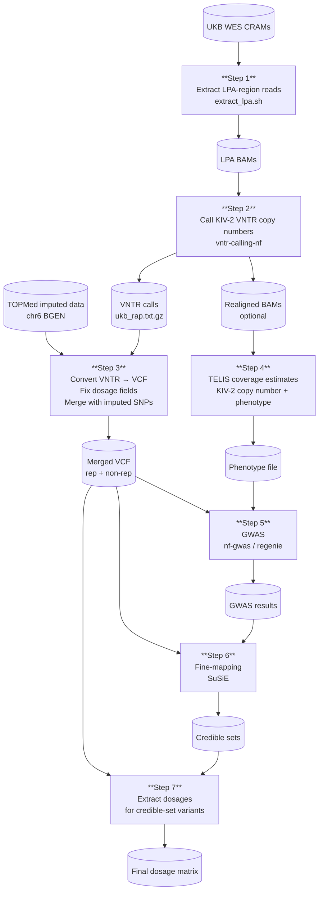

# Computational Pipeline for Resolving the Ancestry-Specific Genetic Architecture of LPA

[](https://nextflow.io/)
[](LICENSE)
[](https://ukbiobank.dnanexus.com/)
[](https://doi.org/10.5281/zenodo.XXXXXXX)

---

## Overview

This repository documents the complete computational pipeline to integrate VNTR variation into GWAS analysis. All analyses have been run on UKB RAP. If you are new to RAP, have a look at the [Getting started with RAP](#getting-started-with-rap) section below.

The pipeline consists of the following steps:

1. Extract LPA-region reads from UK Biobank whole-exome sequencing (WES) CRAM files
2. Call KIV-2 VNTR copy numbers from BAM files using a dedicated Nextflow pipeline
3. Integrate VNTR calls with TOPMed-imputed SNP data for the LPA locus
4. Estimate per-sample KIV-2 copy number using the TELIS approach
5. Run a genome-wide association study (GWAS) for Lp(a) mass per ancestry group
6. Fine-map association signals using SuSiE (Sum of Single Effects)
7. Extract dosages for credible-set variants


## Step 1

The CRAMs are stored in a bucket that cannot be accessed directly. We therefore download the LPA CRAM files, extract the region, and upload the resulting BAMs to a RAP folder.

### Input/Output
| | Files |
|---|---|
| **Input** | `ids_by_ancestry.txt` (e.g. full paths for a specific ancestry) |
| **Output** | Per-sample LPA BAMs (region chr6:160530483–160665260) |

### Workflow
* Execute `dx find data --path "Bulk/Exome sequences/Exome OQFE CRAM files" --name "*.cram" > ids.txt`
* Filter ids.txt by ancestry and save as `ids_by_ancestry.txt`
* Execute `scripts/step1/extract_lpa.sh`.

## Step 2

VNTR copy numbers are resolved using a dedicated Nextflow pipeline.

| | Files |
|---|---|
| **Input** | LPA BAMs from Step 1, `kiv2.fasta` (KIV-2 reference), `ROI-8.bed` (region of interest) |
| **Output** | VNTR calls (`ukb_rap.txt.gz`); optionally realigned BAMs (`realigned/`) needed for Step 4 |

### Set up the pipeline
```
git clone https://github.com/genepi/vntr-calling-nf
# Download ROI-8 (do not use signature approach; only validated in EUR)
wget https://raw.githubusercontent.com/genepi/vntr-calling-nf/refs/heads/main/paper_analysis/lpa/bed/hg38/ROI-8.bed
# for EUR set: params.build="hg38" and remove params.region
```

### Create a config file
Create `ukb.config`:
```
params.project="ukb_rap_ancestry"
params.input="lpa_bams/*bam"
params.reference="reference-data/kiv2.fasta"
params.contig="KIV2_6"
params.region="ROI-8.bed"
```

### CNE estimation (optional)
Required for Step 4. Enable output of realigned BAM data by adding the following to `local/realign_fastq.nf`:

```
publishDir "${params.outdir}/realigned", mode: "copy"
```

### Run the pipeline
```
nextflow run main.nf -c ukb.config --profile docker
```

## Step 3

| | Files |
|---|---|
| **Input** | `ukb_rap.txt.gz` (VNTR calls from Step 2), `ukb21007_c6_b0_v1.bgen/.sample` (TOPMed imputed data, chr6 LPA locus) |
| **Output** | `ukb_combined_final_sorted_with_DS_noGT.vcf.gz` — merged VCF of VNTR repetitive region + imputed non-repetitive region, with DS dosage field |

### Convert VNTR results to a VCF file

```
wget https://github.com/seppinho/mutserve/releases/download/v2.0.3/mutserve.zip
unzip mutserve.zip

# Fix IDs to allow merging with imputed data
zcat ukb_rap.txt.gz | sed -e 's/_23143_0_0_lpa.extracted.kiv2.realigned.bam//g' > ukb_rap_renamed.txt

# Filter by PASS
awk -F'\t' 'NR==1 || $2=="PASS"' ukb_rap_renamed.txt > ukb_rap_renamed_filtered.txt

# Prepare reference (rename KIV2_6 to 6 to avoid merging issues)
wget https://raw.githubusercontent.com/genepi/vntr-calling-nf/refs/heads/main/reference-data/kiv2.fasta
# Edit kiv2.fasta: change "KIV2_6" to "6"

java -jar mutserve.jar create-vcf \
    --input ukb_rap_renamed_filtered.txt \
    --output ukb_rap_renamed_filtered.vcf.gz \
    --reference kiv2.fasta
```

### Download the LPA non-repetitive region from TOPMed
```
qctool \
-g "ukb21007_c6_b0_v1.bgen" \
-s "ukb21007_c6_b0_v1.sample" \
-incl-range 6:160530484-160665259 \
-og "region_chr6.bgen"
```

### Fix dosage fields in the non-repetitive region
The non-repetitive region may lack DS for 0/0 genotypes and sometimes contains only GT. We fix this by replacing GT-only entries with 0, 1, or 2 and by adding DS where DS is ".". The script is available in `scripts/step3`.

```
sh fix_dosage.sh
```

### Merge non-repetitive and repetitive regions
```
sh merge.sh
sh dosage.sh
```

## Step 4

| | Files |
|---|---|
| **Input** | LPA BAMs from Step 1 (`CRAMS/`), realigned BAMs from Step 2 (`realigned/`), BED files in `scripts/step4/input/` |
| **Output** | `coverage_summary_ukb.txt` (TELIS coverage values); `phenotype_ukb_estimates_ancestry.txt` (per-sample KIV-2 copy number + Lp(a) phenotype + covariates) |

### Compute coverage estimates (part 1)

```
sh calc_estimates.sh
```

### Estimate copy number and prepare phenotype file (part 2)

- Start an RStudio instance and open a terminal within RStudio.
- Run the Rmd script to create the phenotype file (`scripts/step4/phenotype.Rmd`).
- Ensure matching sample sets between VCF and phenotype file (especially necessary for fine-mapping):

```
bcftools view --force-samples -S samples.txt -Oz -o <fixed VCF> <output of step 3>
```

## Step 5

| | Files |
|---|---|
| **Input** | `ukb_combined_final_sorted_with_DS_noGT.vcf.gz` (Step 3), `phenotype_ukb_estimates_ancestry.txt` + covariates file (Step 4), array genotypes `ukb22418_c6_b0_v2.*` (PLINK format) |
| **Output** | GWAS summary statistics `lpa_man.regenie_<ancestry>.gz` |

### Prepare GWAS

- Download array data: `dx download "Bulk/Genotype Results/Genotype calls/ukb22418_c6_b0_v2*"`
- Prepare covariates file: `cp phenotype_ukb_estimates_ancestry.txt phenotype_ukb_estimates_ancestry_covariates.txt`

### Run GWAS
```
nextflow run pipelines/nf-gwas/main.nf -c 04_gwas.config -profile docker
```

## Step 6

| | Files |
|---|---|
| **Input** | `ukb_combined_final_sorted_with_DS_noGT.vcf.gz` (Step 3, ancestry-filtered), `lpa_man.regenie_<ancestry>.gz` (GWAS results from Step 5), covariates file |
| **Output** | Credible sets table, LD matrix (`UKB_<ancestry>_ld_residuals.txt`), SuSiE diagnostics plot (`output/susie_diagnostics_plot_*.png`) |

### Prepare fine-mapping input

Remove all SNPs from the VCF that are not in the regenie output so both sets contain the same variants:
```
bash prepare.sh
```

### Run fine-mapping
```
Rscript finemapping.R
```

## Step 7: Extract dosages for credible-set variants

| | Files |
|---|---|
| **Input** | `ukb_kiv2_estimates_final_sorted_with_DS_noGT_<ancestry>_filtered.vcf.gz` (Step 6), `input/afr_credible_sets_pos.txt` (genomic positions of credible-set variants) |
| **Output** | `snps_dosages_estimates_<ancestry>.csv` — sample × credible-set variant dosage matrix |

```
bash scripts/step7/extract_dosages.sh
```

---

## Repository Structure

```
.
├── scripts/
│   ├── environment/
│   │   └── environment.yml           # conda environment for DNAnexus CLI
│   ├── step1/
│   │   └── extract_lpa.sh            # Step 1: download CRAMs, extract LPA BAMs
│   ├── step3/
│   │   ├── fix_dosage.sh             # Step 3: fix missing DS fields in imputed VCF
│   │   ├── merge.sh                  # Step 3: merge VNTR + imputed VCF
│   │   └── dosage.sh                 # Step 3: annotate merged VCF with DS field
│   ├── step4/
│   │   ├── input/
│   │   │   ├── exons1.bed            # Step 4: BED file for TELIS coverage
│   │   │   ├── exons2.bed
│   │   │   ├── kiv2-1.bed
│   │   │   └── kiv2-2.bed
│   │   ├── calc_estimates.sh         # Step 4: TELIS bedtools coverage
│   │   └── phenotype.Rmd             # Step 4: KIV-2 copy number + GWAS phenotype
│   ├── step5/
│   │   └── gwas.config               # Step 5: nf-gwas / regenie config
│   ├── step6/
│   │   ├── prepare.sh                # Step 6: subset VCF to regenie variants
│   │   └── finemapping.R             # Step 6: SuSiE fine-mapping
│   └── step7/
│       └── extract_dosages.sh        # Step 7: credible-set SNP dosage extraction
├── .gitignore
├── LICENSE
└── README.md
```

---


## Getting started with RAP

### Setup
Activate (or build) the conda environment locally to connect to RAP:
```
# Only if the environment does not exist
conda env create --file environment.yml
conda activate dna-nexus
```

### Start a workstation

Start a basic workstation inside RAP:
```
dx run cloud_workstation -imax_session_length=1h --allow-ssh --brief -y --name "PROJECT_NAME"
# Returns job-id
```

### Start a workstation with a snapshot

A snapshot bundles all software needed to run the pipeline and can be created with `dx-create-snapshot` ([docs](https://academy.dnanexus.com/interactivecloudcomputing/cloudworkstation#snapshot)). We recommend installing software into a mamba environment within the snapshot.

```
dx run cloud_workstation \
  -imax_session_length=24h \
  -isnapshot=file-J5y6fyQJP16y0Z622jKg5Bx6 \
  --allow-ssh \
  --brief \
  -y \
  --name "lpa_vntr"
```

### Connect to an instance

SSH configuration is only required once every 30 days:
```
dx ssh_config
# Connect to your job
dx ssh job-XXX
```

Find running machines:
```
dx find jobs --state running
```

### Initialise the workstation environment

After connecting, activate the genomics environment:
```bash
source ~/.bashrc
eval "$(mamba shell hook --shell bash)"
mamba activate genomics
unset DX_WORKSPACE_ID
dx cd $DX_PROJECT_CONTEXT_ID:
```

---

## Pipeline Overview



---

## Contributors

Institute of Genetic Epidemiology, Innsbruck

- **Silvia Di Maio** — fine-mapping (SuSiE), variance explained, CVD analysis
- **Johanna F. Schachtl-Riess** — fine-mapping methodology
- **Sebastian Schönherr** — pipeline development, RAP infrastructure, GWAS


---

## License

Scripts in this repository are released under the [MIT License](LICENSE).
