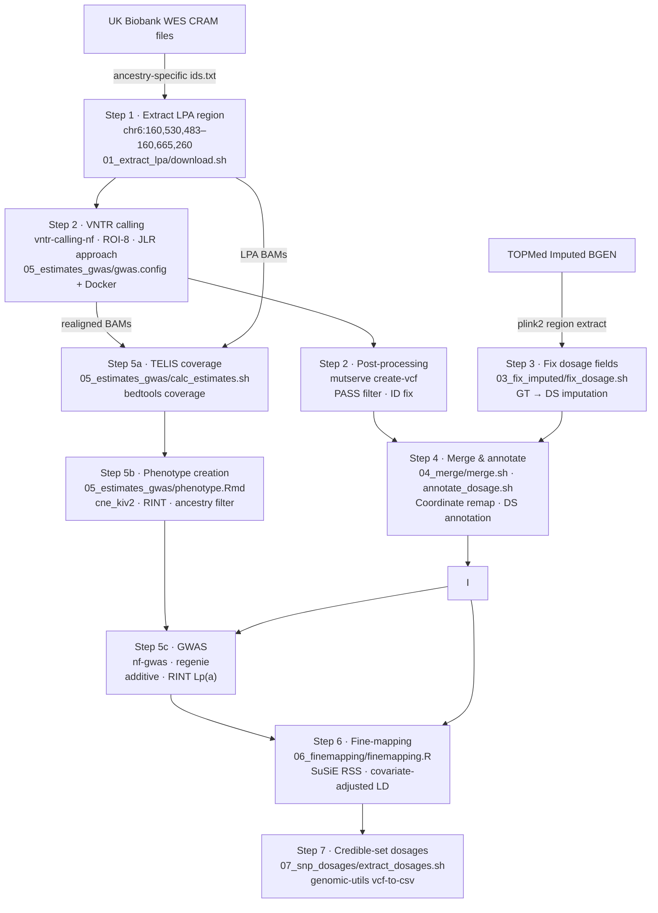

# LPA KIV-2 VNTR Analysis — UK Biobank

[](https://nextflow.io/)
[](LICENSE)
[](https://ukbiobank.dnanexus.com/)
[](https://doi.org/10.5281/zenodo.XXXXXXX)

> **Analysis pipeline for GWAS and fine-mapping of the Lipoprotein(a) KIV-2 VNTR locus across ancestry groups in the UK Biobank, executed on the DNAnexus Research Analysis Platform (RAP).**

---

## Overview

The *LPA* gene encodes apolipoprotein(a), a major determinant of circulating Lp(a) concentrations, a causal risk factor for coronary artery disease. The gene contains a hypervariable Kringle IV type-2 (KIV-2) tandem repeat that is the primary genetic determinant of Lp(a) levels but is inaccessible to standard genotyping arrays and imputation. This repository documents the complete computational pipeline used to:

1. Extract LPA-region reads from UK Biobank whole-exome sequencing (WES) CRAM files
2. Call KIV-2 VNTR copy numbers from BAM files using a dedicated Nextflow pipeline
3. Integrate VNTR calls with TOPMed-imputed SNP data for the LPA locus
4. Estimate per-sample KIV-2 copy number using the TELIS approach
5. Run a genome-wide association study (GWAS) for Lp(a) mass per ancestry group
6. Fine-map association signals using SuSiE (Sum of Single Effects)
7. Extract dosages for credible-set variants

The pipeline is designed to run per ancestry group and has been applied to African (AFR), as well as other UK Biobank ancestry groups. Ancestry-specific sample lists (`ids.txt`) are the only input that changes between runs.

---

## Pipeline Overview



---

## Repository Structure

```
.
├── 01_extract_lpa/
│   └── download.sh               # Step 1: download CRAMs, extract LPA BAMs
├── 03_fix_imputed/
│   └── fix_dosage.sh             # Step 3: fix missing DS fields in imputed VCF
├── 04_merge/
│   ├── merge.sh                  # Step 4: merge VNTR + imputed VCF, remap coordinates
│   └── annotate_dosage.sh        # Step 4: annotate merged VCF with DS field
├── 05_estimates_gwas/
│   ├── calc_estimates.sh         # Step 5a: TELIS bedtools coverage
│   ├── phenotype.Rmd             # Step 5b: KIV-2 copy number + GWAS phenotype
│   └── gwas.config               # Step 5c: nf-gwas / regenie config
├── 06_finemapping/
│   ├── prepare.sh                # Step 6: subset VCF to regenie variants
│   └── finemapping.R             # Step 6: SuSiE fine-mapping
├── 07_snp_dosages/
│   └── extract_dosages.sh        # Step 7: credible-set SNP dosage extraction
├── .gitignore
├── LICENSE
└── README.md
```

---

## Prerequisites

### Platform

All cloud steps run on [DNAnexus Research Analysis Platform (RAP)](https://ukbiobank.dnanexus.com/) using a custom workstation snapshot (`file-J5y6fyQJP16y0Z622jKg5Bx6`) that bundles all required software.

### Software

| Tool | Version / Source | Purpose |
|------|-----------------|---------|
| [Nextflow](https://nextflow.io/) | ≥ 24.x | Pipeline orchestration |
| [vntr-calling-nf](https://github.com/genepi/vntr-calling-nf) | main | KIV-2 VNTR calling |
| [nf-gwas](https://github.com/genepi/nf-gwas) | main | GWAS via regenie |
| [samtools](https://www.htslib.org/) | ≥ 1.17 | BAM/CRAM extraction |
| [bcftools](https://www.htslib.org/) | ≥ 1.17 | VCF manipulation |
| [plink2](https://www.cog-genomics.org/plink/2.0/) | ≥ 2.0 | BGEN → VCF conversion |
| [qctool](https://www.well.ox.ac.uk/~gav/qctool_v2/) | v2.2.0 | BGEN subsetting |
| [bedtools](https://bedtools.readthedocs.io/) | ≥ 2.30 | Coverage calculation |
| [mutserve](https://github.com/seppinho/mutserve) | v2.0.3 | VNTR VCF creation |
| [Docker](https://www.docker.com/) | ≥ 24 | Reproducible pipeline execution |
| R ≥ 4.3 | CRAN | Statistics and fine-mapping |
| R packages | `susieR`, `vcfR`, `data.table`, `tidyverse`, `Matrix` | Fine-mapping and data wrangling |

### Local environment (for dx-toolkit)

```bash
conda env create --file conda/environment.yml
conda activate dna-nexus
```

---

## Reproducibility

This pipeline is designed for exact reproducibility across runs and analysts:

| Layer | Mechanism |
|-------|-----------|
| Cloud environment | DNAnexus workstation snapshot `file-J5y6fyQJP16y0Z622jKg5Bx6` — all bioinformatics tools pre-installed at fixed versions |
| Pipeline execution | All Nextflow pipelines run with `--profile docker` — containerised, version-pinned |
| VNTR calling | `vntr-calling-nf` ROI-8 BED file downloaded from a pinned GitHub commit ref |
| R environment | `06_finemapping/finemapping.R` and `05_estimates_gwas/phenotype.Rmd` list all package versions; run `sessionInfo()` at the end of each script to capture the full R environment |
| Ancestry selection | Defined exclusively by `ids.txt`; all downstream steps are deterministic given the same input |
| Randomness | `susie_rss()` uses no stochastic steps; results are fully deterministic |

### R Session Info

To capture the R environment used for fine-mapping and phenotype creation, add the following at the end of any R script before submitting:

```r
writeLines(capture.output(sessionInfo()), "sessionInfo.txt")
```

---

## Quality Control Checkpoints

| Step | Check | How |
|------|-------|-----|
| 1 | CRAM download completeness | Compare line count of `filtered_paths.txt` to uploaded BAMs |
| 2 | VNTR call rate | Fraction of samples with `PASS` filter in `ukb_rap_renamed.txt` |
| 3 | DS field coverage | `bcftools stats` on `region_chr6_fixed.vcf.gz`; expect no missing DS |
| 4 | Sample overlap after merge | `common_ids.txt` size vs. input VCF sample counts |
| 5a | Coverage symmetry | Relative difference `abs(kiv2_1 - kiv2_2) / mean` filtered at 99.9% |
| 5b | Phenotype distribution | Histogram of `cne_kiv2` in `.Rmd` output; visual QC before GWAS |
| 6 | SuSiE diagnostics | `lambda` from `estimate_s_rss()` (target < 0.1); z-score kriging plot |
| 6 | LD matrix validity | Checked for symmetry and PSD; adjusted with `nearPD()` if needed |

---

## Step-by-Step Instructions

### Setup: Connect to DNAnexus RAP

```bash
dx login                    # authenticate (2FA required)
dx find jobs --state running  # check running jobs
```

Start a workstation with the pre-built snapshot:

```bash
dx run cloud_workstation \
  -imax_session_length=24h \
  -isnapshot=file-J5y6fyQJP16y0Z622jKg5Bx6 \
  --allow-ssh --brief -y --name "lpa_vntr"
```

Initialise the workstation environment:

```bash
source ~/.bashrc
eval "$(mamba shell hook --shell bash)"
mamba activate genomics
unset DX_WORKSPACE_ID
dx cd $DX_PROJECT_CONTEXT_ID:
```

---

### Step 1 — Extract LPA Region from WES CRAMs

List all exome CRAM files and filter for the target ancestry sample IDs (provide `ids.txt` for the desired ancestry group):

```bash
dx find data --path "Bulk/Exome sequences/Exome OQFE CRAM files" --name "*.cram" > all_files.txt
grep -Ff ids.txt all_files.txt | sed -n 's/.*\(\/Bulk\/.*\.cram\).*/\1/p' > filtered_paths.txt
```

Download each CRAM, extract the LPA locus (chr6:160,530,483–160,665,260), and upload the resulting BAM:

```bash
bash 01_extract_lpa/download.sh &> lpa_processing.log
```

**Output:** BAMs uploaded to `ukb_{ancestry}/01_bam_paths/lpa_bams/`

---

### Step 2 — VNTR Calling

```bash
dx download -r ukb_{ancestry}/01_bam_paths/lpa_bams
wget https://raw.githubusercontent.com/genepi/vntr-calling-nf/refs/heads/main/paper_analysis/lpa/bed/hg38/ROI-8.bed
nextflow run main.nf -c 05_estimates_gwas/gwas.config --profile docker
```

Convert and filter output:

```bash
zcat ukb_rap.txt.gz | sed -e 's/_23143_0_0_lpa.extracted.kiv2.realigned.bam//g' > ukb_rap_renamed.txt
awk -F'\t' 'NR==1 || $2=="PASS"' ukb_rap_renamed.txt > ukb_rap_renamed_filtered.txt

# Create VCF
java -jar mutserve.jar create-vcf \
    --input ukb_rap_renamed_filtered.txt \
    --output ukb_rap_renamed_filtered.vcf.gz \
    --reference kiv2.fasta
```

**Output:** `ukb_{ancestry}/02_vntr_pipeline/output/ukb_rap_renamed_filtered.vcf.gz`

---

### Step 3 — Extract and Fix Imputed Data

Extract LPA region from TOPMed imputed BGEN:

```bash
plink2 \
  --bgen "Bulk/Imputation/Imputation from genotype (TOPmed)/ukb21007_c6_b0_v1.bgen" ref-first \
  --sample "Bulk/Imputation/Imputation from genotype (TOPmed)/ukb21007_c6_b0_v1.sample" \
  --chr 6 --from-bp 160530484 --to-bp 160665259 \
  --export vcf bgz vcf-dosage=DS id-paste=iid \
  --out region_chr6
```

Fix missing `DS` fields (some GT-only entries):

```bash
bash 03_fix_imputed/fix_dosage.sh
```

**Output:** `ukb_{ancestry}/03_extract_imputed/region_chr6_fixed.vcf.gz`

> Note: The imputed BGEN contains all UK Biobank samples; per-ancestry subsetting happens at Step 5.2 when the phenotype file is created.

---

### Step 4 — Merge VNTR + Imputed Data

```bash
bash 04_merge/merge.sh          # merge, remap repetitive-region coordinates, intersect samples
bash 04_merge/annotate_dosage.sh  # annotate with DS field (fallback: AF+1 for VNTR variants)
```

**Output:** `ukb_{ancestry}/04_merge_dosage/ukb_combined_final_sorted_with_DS_noGT.vcf.gz`

---

### Step 5 — KIV-2 Copy Number Estimates and GWAS

**5.1 Coverage-based estimates (TELIS):**

```bash
bash 05_estimates_gwas/calc_estimates.sh    # produces coverage_summary_ukb.txt
```

**5.2 Phenotype file and copy number calculation (RStudio):**

Open `05_estimates_gwas/phenotype.Rmd` in an RStudio instance on RAP. This:
- Applies the TELIS formula: `cne_kiv2 = 0.5 * (kiv2_1 / (exons1/8) + kiv2_2 / (exons2/8))`
- Joins with Lp(a) mass (`lpa_man`) and covariates (sex, age, genotyping array, 30 PCs)
- Filters to the target ancestry group and writes `phenotype_ukb_estimates_{ancestry}.txt`

**5.3 GWAS with regenie:**

```bash
nextflow run pipelines/nf-gwas/main.nf -c 05_estimates_gwas/gwas.config -profile docker
```

Key parameters (see `05_estimates_gwas/gwas.config`):
- Phenotype: `lpa_man` (rank-inverse normal transformed)
- Covariates: `cne_kiv2`, sex, age, array, PCs 1–30
- Filters: imputation score ≥ 0.3, MAC ≥ 20
- Test: additive

**Output:** `ukb_{ancestry}/05_estimates_gwas/gwas/output/lpa_man.regenie.gz`

---

### Step 6 — Fine-mapping (SuSiE)

Subset VCF to variants in regenie output:

```bash
bash 06_finemapping/prepare.sh
```

Run SuSiE RSS with covariate-adjusted LD matrix estimated within the ancestry group (L = 50 components):

```bash
Rscript 06_finemapping/finemapping.R
```

This script:
1. Extracts DS matrix from the filtered VCF
2. Removes covariate effects from genotype matrix
3. Computes pairwise LD from residuals
4. Runs `susie_rss()` with z-scores from regenie
5. Outputs credible sets to `output/{ancestry}_credible_sets.txt`

---

### Step 7 — Extract Credible-Set SNP Dosages

```bash
bash 07_snp_dosages/extract_dosages.sh
```

**Output:** `snps_dosages_estimates_{ancestry}.csv` — one column per credible-set variant, rows are samples.

---

## Data Availability

All analyses use UK Biobank data (Application #XXXXX). Access requires a valid UK Biobank application:
- **Exome sequencing:** `Bulk/Exome sequences/Exome OQFE CRAM files/`
- **Imputed genotypes:** `Bulk/Imputation/Imputation from genotype (TOPmed)/ukb21007_c6_b0_v1.bgen`
- **Genotyping array:** `Bulk/Genotype Results/Genotype calls/ukb22418_c6_b0_v2.*`

The VNTR calling pipeline and reference data are publicly available:
- [vntr-calling-nf](https://github.com/genepi/vntr-calling-nf)
- [ROI-8.bed](https://raw.githubusercontent.com/genepi/vntr-calling-nf/refs/heads/main/paper_analysis/lpa/bed/hg38/ROI-8.bed)
- [kiv2.fasta reference](https://github.com/genepi/vntr-calling-nf/tree/main/reference-data)

---

## Key Methods Notes

- **ROI-8 / JLR approach** was used for VNTR calling. The signature approach was deliberately excluded as it has only been validated in European ancestry populations and is not expected to generalize across ancestries.
- **Ancestry groups** are defined by UK Biobank self-reported ethnicity codes. The pipeline has been applied to African ancestry (codes 4001–4003) and is designed to run on any ancestry group by swapping the `ids.txt` sample list.
- **Coordinate remapping:** KIV-2 exon positions in the repetitive reference space are linearly remapped to hg38 positions before merging with imputed data, enabling joint analysis on a common coordinate system.
- **LD for fine-mapping** is estimated from covariate-adjusted genotype residuals within the ancestry-specific study sample rather than from an external reference panel, ensuring population-matched LD structure.

---

## Citation

> [Authors]. LPA KIV-2 VNTR GWAS and fine-mapping across ancestry groups in the UK Biobank. *[Journal]*, 2026.

```bibtex
@article{authors2026lpa,
  title   = {{LPA} {KIV-2} {VNTR} {GWAS} and fine-mapping across ancestry groups in the {UK} {Biobank}},
  author  = {[Authors]},
  journal = {[Journal]},
  year    = {2026},
  doi     = {10.XXXX/XXXXXX}
}
```

Scripts archived at: [](https://doi.org/10.5281/zenodo.XXXXXXX)

---

## Contributors

- **Sebastian** — pipeline development, RAP infrastructure, GWAS
- **Silvia Di Maio** — fine-mapping (SuSiE), covariate adjustment
- **Johanna F. Schachtl-Riess** — fine-mapping methodology basis

---

## License

Scripts in this repository are released under the [MIT License](LICENSE).
